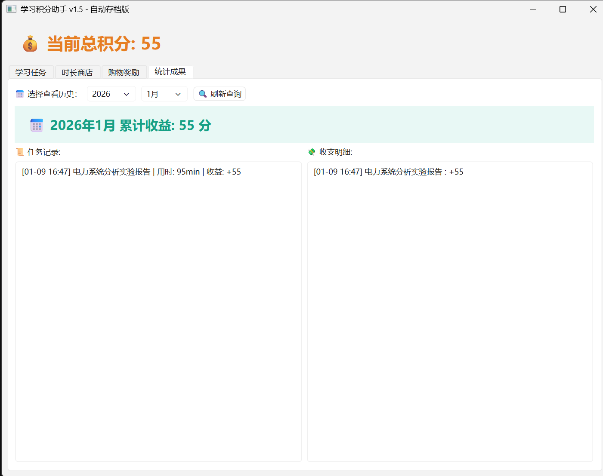

# Study-incentive-Assistant
这是一个基于 Python和 PySide6 开发的桌面实用程序，旨在通过“积分激励”系统提高学习效率。
# 学习积分助手 (Study Incentive Assistant) 🚀

[简体中文](#-项目简介) | [English](#-introduction)

---

## 🇨🇳 项目简介
这是一个基于 **Python** 和 **PySide6 (Qt for Python)** 开发的桌面实用程序，旨在通过“积分激励”系统提高学习效率。

## 📸 界面预览 (Preview)

### ✨ 核心功能
* **多类型任务管理**：支持一次性任务、常规任务和限时签到任务。
* **积分经济系统**：通过完成学习任务赚取积分，用于兑换“娱乐时长”或实物奖励。
* **自动存档**：使用 `pickle` 实现本地数据序列化，确保学习记录不丢失。
* **可视化统计**：支持按月份查询学习成果和积分收支明细。

### 🛠️ 技术栈
* **语言**: Python 3.x
* **GUI 框架**: PySide6 (Qt 6)
* **数据持久化**: Pickle (Object Serialization)

---

## 🇺🇸 Introduction
A professional desktop application built with **Python** and **PySide6**, designed to boost productivity through a gamified "Point Incentive" system.

### ✨ Key Features
* **Task Management**: Supports One-time, Routine, and Timed Check-in tasks.
* **Gamification**: Earn points through study sessions to purchase "Entertainment Time" or rewards.
* **Auto-Save**: Implemented local data persistence using `pickle` for reliable data storage.
* **Statistics**: Monthly tracking of study achievements and point balance history.

### 🛠️ Tech Stack
* **Language**: Python 3.x
* **GUI Framework**: PySide6 (Qt 6)
* **Persistence**: Pickle (Serialization)

---

## 🚀 如何运行 (How to Run)
1. 安装依赖 (Install dependencies):
   `pip install PySide6`
2. 运行程序 (Run app):
   `python main.py`
